# Mario Gracia Torres Actividad 0: Sistemas de control de versiones
===============


## 1 Creación de Proyecto y repositorio

Utilizamos los comandos mkdir para crear la carpeta y entrar en ella con cd

```
mkdir PPS-Unidad0ActividadGit-$Mario
cd PPS-Unidad0ActividadGit-$Mario
```
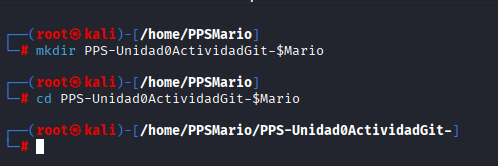

Entramos a Github con nuestra cuenta y creamos un nuevo repositorio publico. Lo llamamos PPS-Unidad0ActividadGit-$Mario

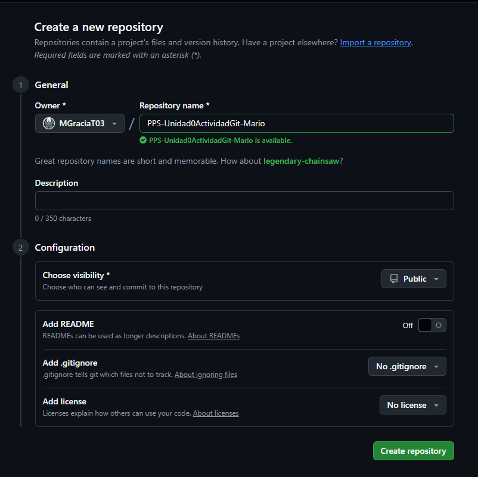
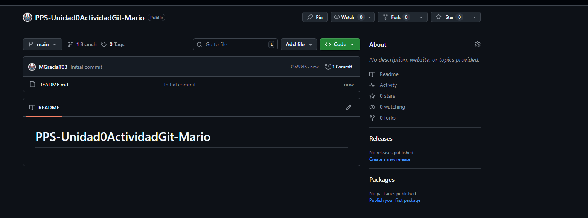

para clonarlo o subirlo a Debian, copiamos el codigo ssh y lo pegamos en la maquina virtual donde queremos crear el repositorio

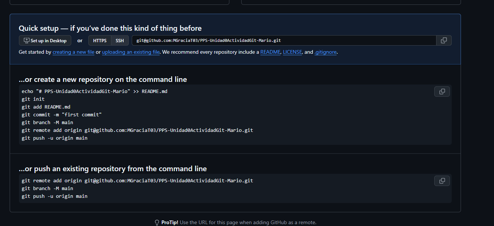

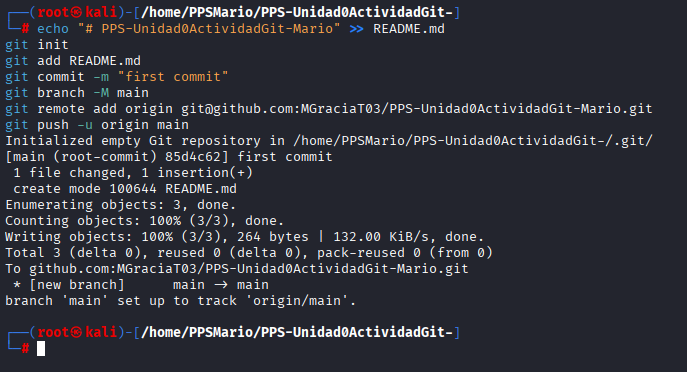

## 2 Estructurando el proyecto

Vamos a empezar a crear la estructura de nuestro proyecto

Creamos la carpeta de calculator y varios ficheros como  ```__init__.py``` ```gui.py```  ```mkdocs.yml``` ```requiriments.txt```

dejando una estructura asi:
1. La estructura del proyecto debe de ser la siguiente:

PPS-Unidad0ActividadGit-Mario/   
├── calculator/   
│   ├── __init__.py   
│   └── gui.py   
├── docs/   
│   └── index.md   
├── mkdocs.yml   
├── requirements.txt   


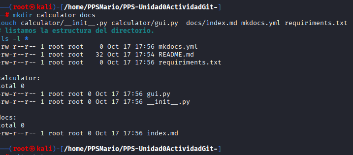

Comprobamos el estado con git status y vemos la organizacion del directorio
```
git status
```
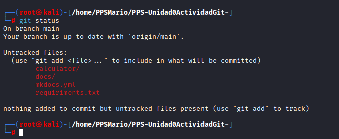

```
git status
```

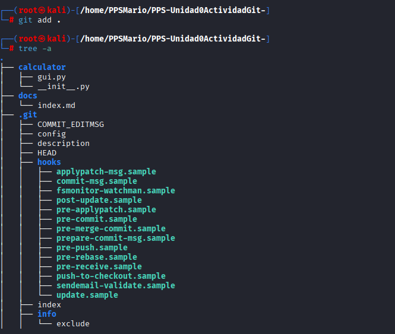

Modificamos los ficheros  ```__init__.py``` ```gui.py```  ```mkdocs.yml``` ```index.md``` ```requiriments.txt```

Hacemos los cambios al repositorio subiendo un commit

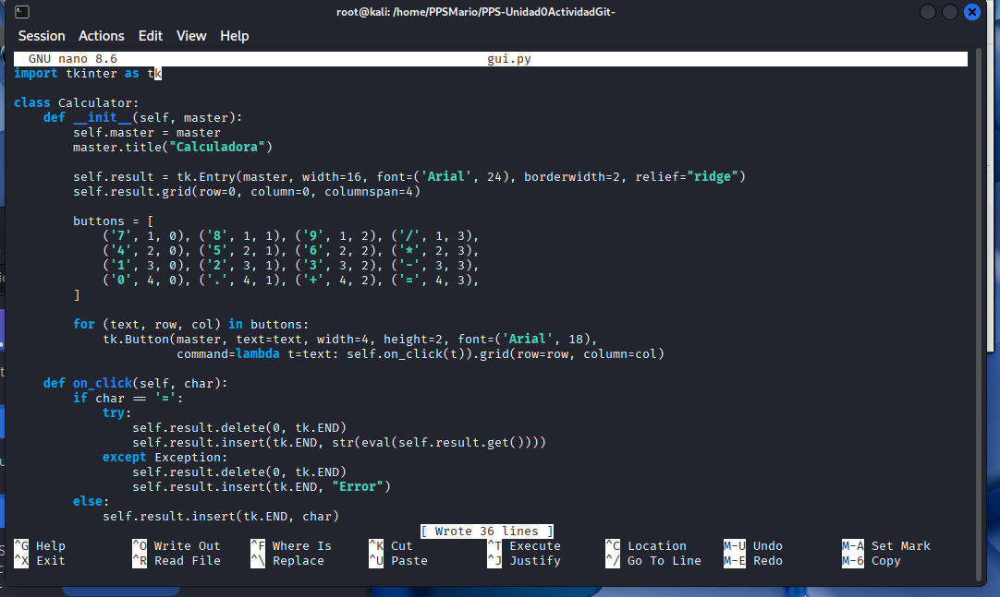


<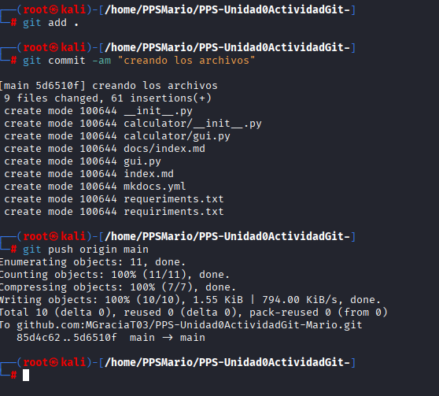


## 3 Ignorando archivos del repositorio

1. Creamos la ucarpeta con nombre `Excluded`

2. creamos un archivo con nombre excluido.txt 


3. Crea un archivo con nombre .gitignore 

4. Indicamos en el .gitignore que los archivos con extensión **.txt** y el directorio `Excluded`

5. Hacemos los cambios al repositorio

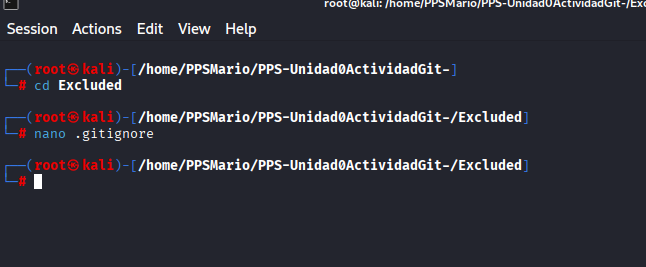


## 4Levantar un pequeño Servidor Web con PHP


hacemos los cambios al fichero ```index.html```

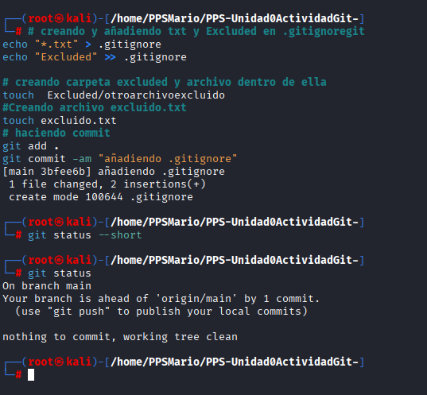

Refrescamos los cambios con git status 


usamos gitt diff para modificar el fichero index.html para que cambie el texto mostrado y ver que ha cambiado el mensaje en la web

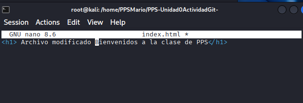

Usamos restore para restaurar el mensaje original de la web 


Finalmente hacemos los cambios y los subimos

## 5 Git log

1. Para mostrar los logs generales
```bash 
git log
```
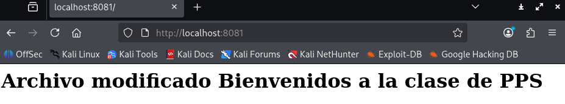

1. Para mostrar los logs de los últimos 3 commits y los logs utilizando el modificador ``--pretty`

```bash 
git log -3
git log --pretty=oneline
```

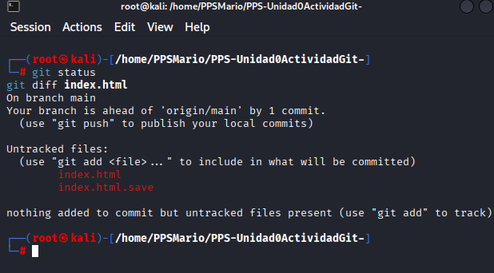

1. Para mostrar los logs de los últimos 2 commits donde se vean las diferencias de cada una de las entradas y los logs de las modificaciones realizadas en el último día.
```bash 
git log -p -2
git log --since=1.day
```

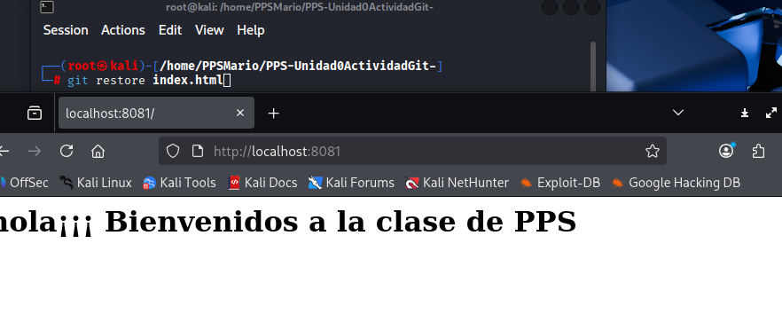


## 6 Ramas

1. Listamos las ramas existentes.
```bash 
git branch --list
```
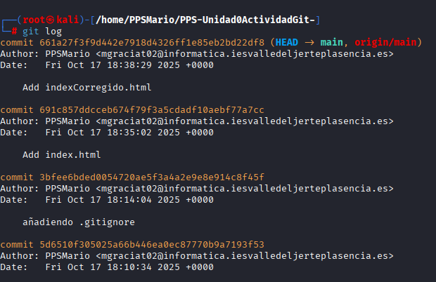


1. Elimina el archivo index.html.save y creamos una rama dev a la rama actual

```bash
git rm index.html.save
git commit -am "eliminando index.html.save"
git push origin main
git chekout -b dev
```

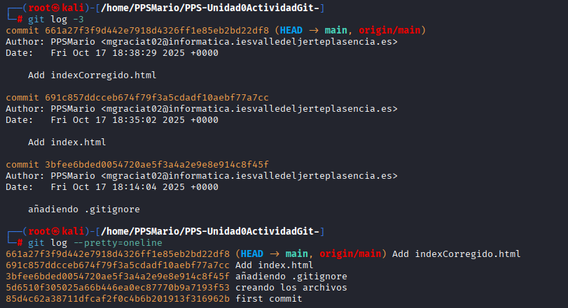


1. Subimos los cambios al respositorio remoto a la rama `dev`  

```bash 
git push origin dev
```
En este caso, vemos las ramas `main` y `dev` son diferentes.


